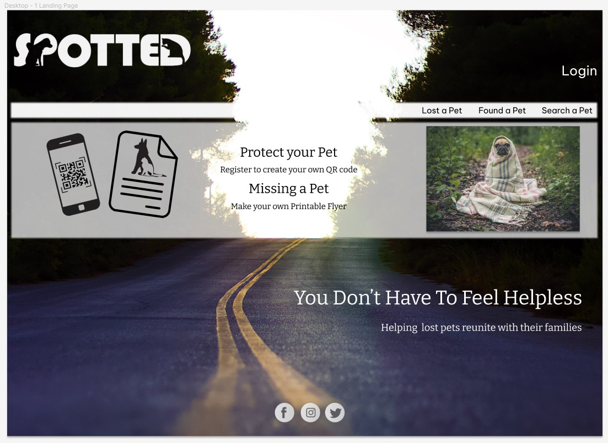
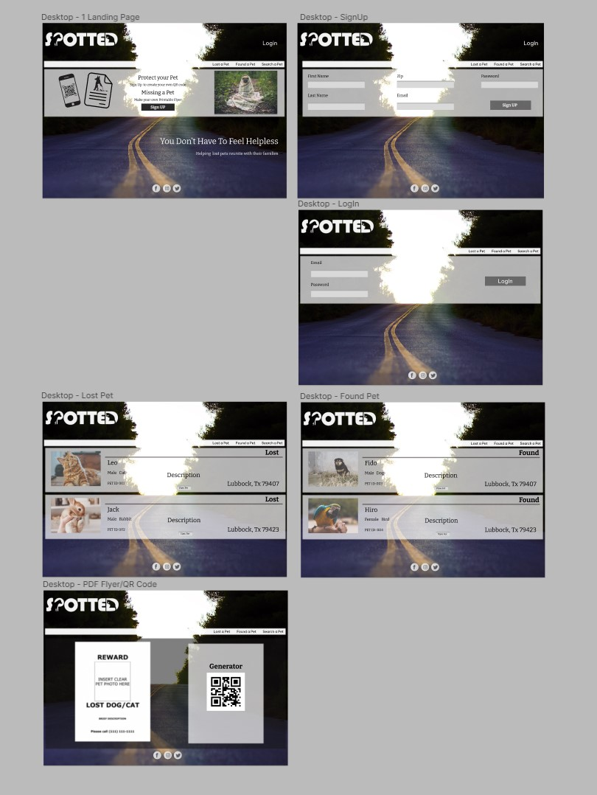

# Spotted Frontend v2

## React.js CRUD App with React Router & Axios

The purpose of Spotted is to help reunite lost pets with their owners and maybe even help abandoned pets find new homes.

The function is to let users post lost pets or found pets with a description, photo, last seen date and location last seen.

- Create lost or found pet
- Read active listings of lost/found
- Update information on lost/found pets
- Delete posts when no longer needed

*extra features*

- printable pdf flyer
- generate qr code

*future planning*

- post onto social media (facebook) to reach more viewers
- google maps api for location tracking
- microchip local shelter database api

## Wireframe

*Landing Page Mockup*

*Wireframe Mockup - First Draft*

## **Tech Stacks**

* mui
* emotion
* node.js
* axios
* react.js
* gh-pages

heroku no longer offer free tier

* ~~* heroku~~

## **Backend**
[SpottedDB_V2 ](https://github.com/RosalynS78/spottedDB_v2.git)
